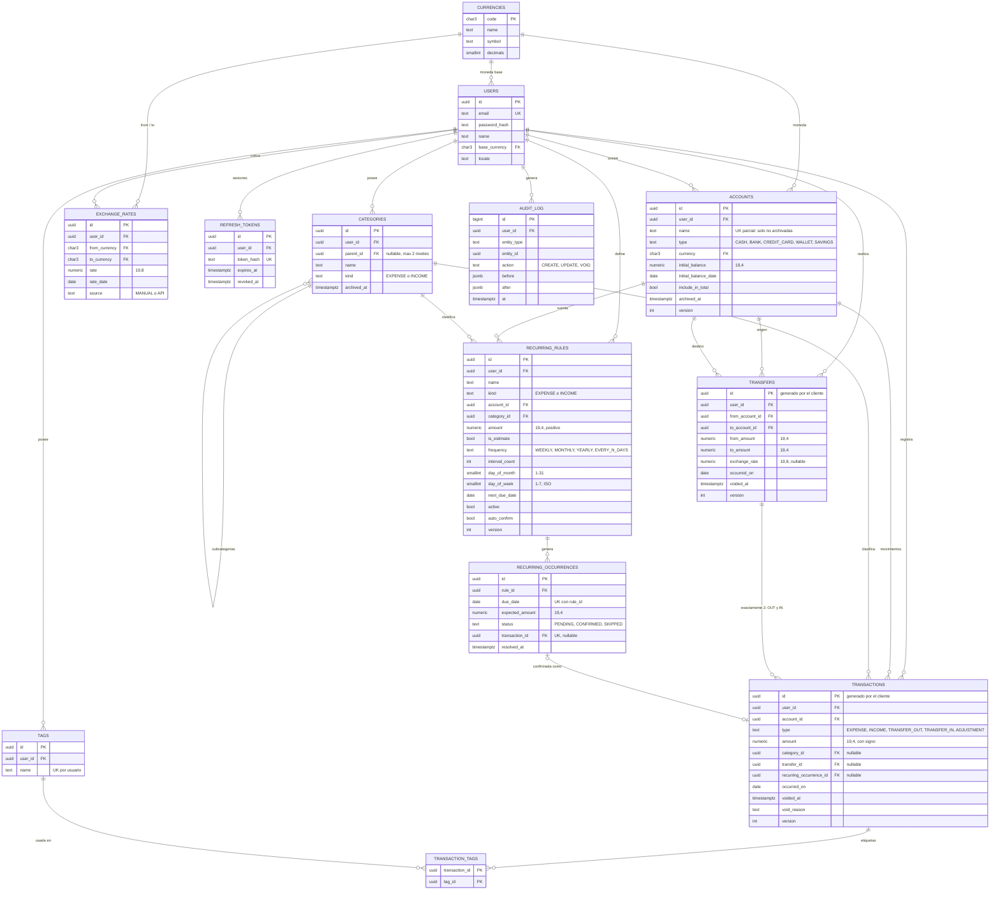

# Modelo ER: fase 1

Diagrama del esquema definido en `apps/api/src/main/resources/db/migration/V1__fase1_esquema.sql`.
Solo muestra las columnas clave; el detalle completo está en la migración.

Convención: los montos son `NUMERIC(19,4)`, las monedas `CHAR(3)` (ISO 4217) y todas las tablas tienen `created_at` y `updated_at`.

## Invariantes garantizadas por la base

| Regla | Dónde se garantiza |
|---|---|
| Signo del monto según el tipo (EXPENSE y TRANSFER_OUT < 0, INCOME y TRANSFER_IN > 0, ADJUSTMENT ≠ 0) | `CHECK` en `transactions` |
| `category_id` obligatorio solo para EXPENSE e INCOME | `CHECK` en `transactions` |
| `transfer_id` obligatorio solo para TRANSFER_OUT y TRANSFER_IN | `CHECK` en `transactions` |
| La categoría coincide con el tipo del movimiento (gasto con categoría de gasto) | Trigger `transactions_check_refs` |
| Una transferencia tiene exactamente una salida y una entrada que coinciden con sus montos y cuentas | Trigger diferido `trg_transfers_pair` / `trg_transactions_pair` (se evalúa al COMMIT) |
| Transferencia en la misma moneda: `from_amount = to_amount` y `exchange_rate` NULL; en distinta moneda, `exchange_rate` obligatorio | Trigger `trg_transfers_accounts` |
| Máximo 2 niveles de categorías y la subcategoría tiene el tipo de su padre | Trigger `trg_categories_hierarchy` |
| Cada ocurrencia recurrente se confirma una sola vez y cada transacción apunta a una sola ocurrencia | Índices únicos parciales y `UNIQUE` en `recurring_occurrences.transaction_id` |
| Una ocurrencia `CONFIRMED` tiene transacción vinculada | `CHECK` en `recurring_occurrences` |
| Entidades de un usuario no referencian datos de otro usuario | Triggers `transactions_check_refs`, `transfers_check_accounts`, `recurring_rules_check_refs`, `categories_check_hierarchy` |
| `audit_log` es solo de inserción | Trigger `trg_audit_log_immutable` |
| Saldo derivado: `initial_balance + SUM(amount)` de los movimientos no anulados | Vista `v_account_balances` (V3) |
